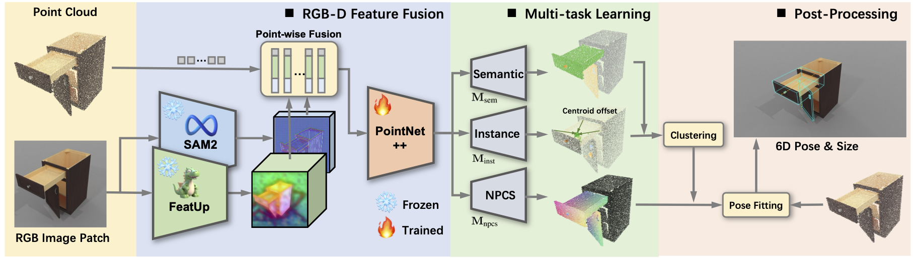

# CAP-Net: A Unified Network for 6D Pose and Size Estimation of Categorical  Articulated Parts from a Single RGB-D Image

<table>
  <tr>
    <td></td>
  </tr>
</table>

## 📝 Overview
This repository contains the PyTorch implementation of the paper "CAP-Net: A Unified Network for 6D Pose and Size Estimation of Categorical Articulated Parts from a Single RGB-D Image"
[[Website]](https://shanehuanghz.github.io/CAPNet/) [[Paper]](https://arxiv.org/pdf/2504.11230)
## 📚 Dependencies
* python >= 3.10
* torch >= 2.5.1
* torchvision >= 0.20.1


## ⚙️ Installation
```
conda create -n capnet python=3.10
conda activate capnet

pip install -r requirements.txt

git clone https://github.com/facebookresearch/sam2.git && cd sam2
pip install -e .

git clone https://github.com/mhamilton723/FeatUp.git
cd FeatUp
pip install -e .

cd networks/pts_encoder/pointnet2_utils/pointnet2
python setup.py install
```

## 📊 Prepare Dataset
Download the datasets from the following links:  
- [RGBD-Art dataset (Baidu Cloud)](https://pan.baidu.com/s/1iz-yAZ4OogosdxfQ5k9_eQ?pwd=874k)
- [Sample dataset (Google Drive)](https://drive.google.com/file/d/1fs6cYzlL0MPsE1Lw1unnUh5QhiaUQMDk/view?usp=sharing)  
- [RGBD-Art dataset (Dropbox)](https://www.dropbox.com/scl/fo/ilcfeahybp9ohccjj88yw/AFNZat-41S17JTJUx6OzyH4?rlkey=6hm1p6q07j95zfde6yu7b4meu&st=9eulwg9g&dl=0)

After downloading, unzip and place all files under `./data`.  

## 🪄 Inference
We provide the pretrain models of `CAPNet` at [Baidu Cloud](https://pan.baidu.com/s/1iz-yAZ4OogosdxfQ5k9_eQ?pwd=874k) and [Google Drive](https://drive.google.com/file/d/1RFmB44T-z-8dt-unMojsPOmhm16ddUr3/view?usp=sharing).
```
bash scripts/eval.sh
```
The predict results will be saved in the folder of `./result`

 

## 🔖 Citation
If you find our work helpful, please consider citing:
```
@misc{huang2025capnetunifiednetwork6d,
      title={CAP-Net: A Unified Network for 6D Pose and Size Estimation of Categorical Articulated Parts from a Single RGB-D Image}, 
      author={Jingshun Huang and Haitao Lin and Tianyu Wang and Yanwei Fu and Xiangyang Xue and Yi Zhu},
      year={2025},
      eprint={2504.11230},
      archivePrefix={arXiv},
      primaryClass={cs.CV},
      url={https://arxiv.org/abs/2504.11230}, 
}
```

## 🌹 Acknowledgment
Our implementation leverages the code from [NOCS](https://github.com/hughw19/NOCS_CVPR2019), [SARNet](https://github.com/hetolin/SAR-Net), [GAPartNet](https://github.com/PKU-EPIC/GAPartNet) and [GenPose2](https://github.com/Omni6DPose/GenPose2). Thanks for the authors' work.